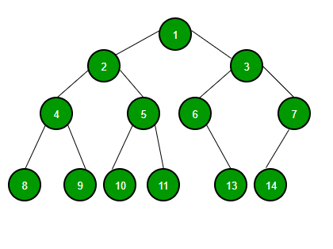
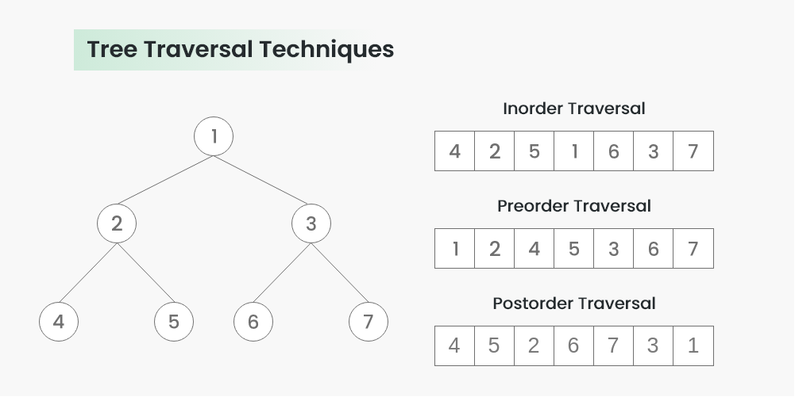
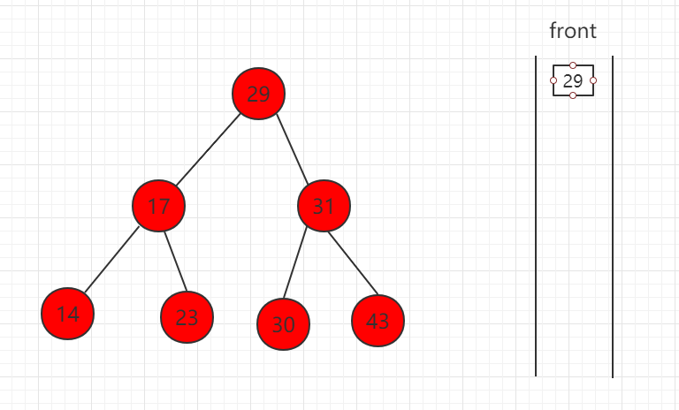
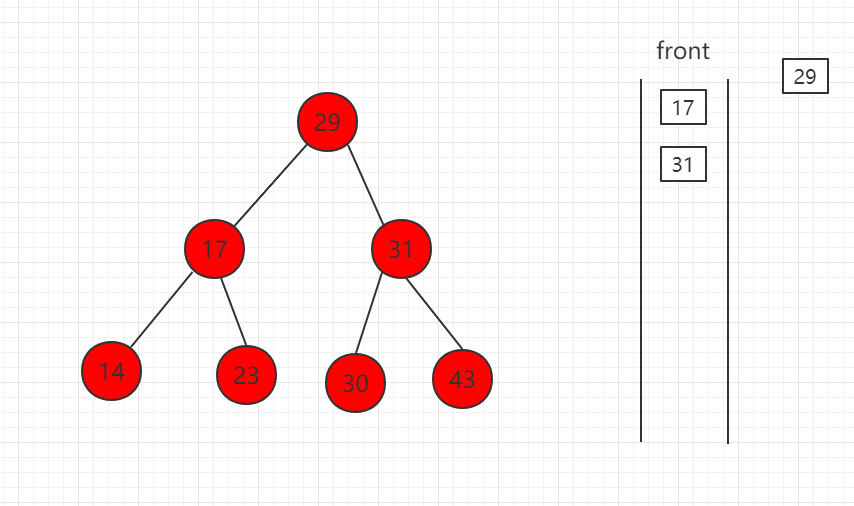
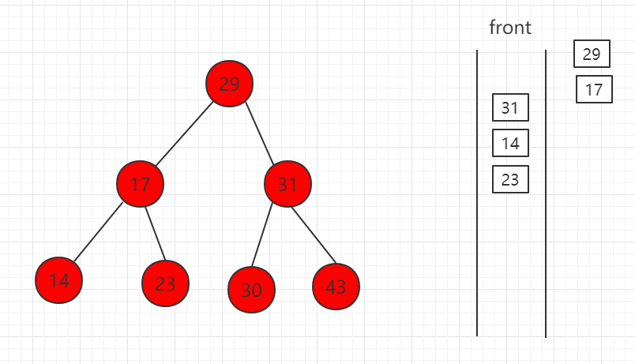
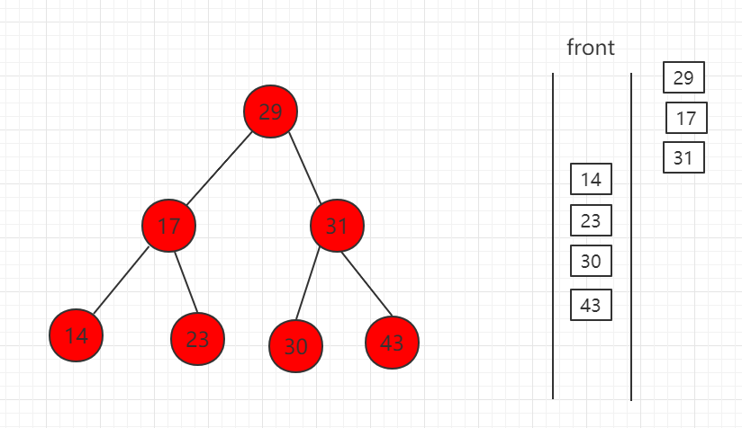
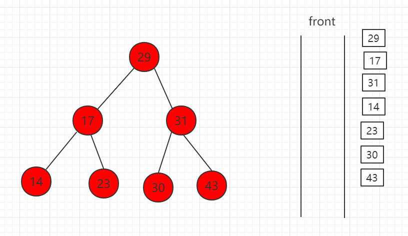
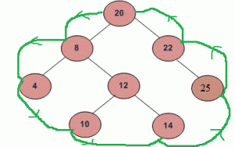
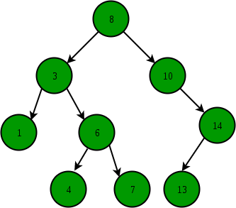

# Binary Tree
## Binary Tree
* Binary Tree is defined as a tree data structure where each node has at most 2 children. Since each element in a binary tree can have only 2 children, we typically name them the left and right child.

 
## Binary Tree Node
Each binary tree node has 3 components:
* Data
* Pointer to left child
* Pointer to right child

## Create of Binary Tree
A Binary tree is represented by a pointer to the topmost node (commonly known as the “root”) of the tree. If the tree is empty, then the value of the root is NULL.
1. Create the node structure
    ``` C Sharp
    public class TreeNode
    {
        public int Value { get; set; }
        public TreeNode Left { get; set; }
        public TreeNode Right { get; set; }

        public TreeNode(int value)
        {
            Value = value;
            Left = null;
            Right = null;
        }
    }
    ```
2. Create the nodes and connecting them together. Start with root node and then add the child nodes as needed.
    ``` C Sharp 
    // Create the root node
    TreeNode root = new TreeNode(1);

    // Add left and right children
    root.Left = new TreeNode(2);
    root.Right = new TreeNode(3);

    // Add more nodes as needed
    root.Left.Left = new TreeNode(4);
    root.Left.Right = new TreeNode(5);
    ```
3. Repeat the step 2 for each node to build the entire tree structure.

## Tree Traversal
### 1. Depth First Search or DFS

   + Inorder Traversal: 
     1. Traverse the left subtree, i.e., call Inorder(left->subtree)
     2. Visit the root.
     3. Traverse the right subtree, i.e., call Inorder(right->subtree)
        ``` C Sharp 
        // C# program for different
        // tree traversals
        using System;

        // Class containing left and right child of
        // current node and key value
        class Node {
            public int key;
            public Node left, right;

            public Node(int item)
            {
                key = item;
                left = right = null;
            }
        }

        class BinaryTree {

            // Root of Binary Tree
            Node root;

            BinaryTree() { root = null; }

            // Given a binary tree, print
            // its nodes in inorder
            void printInorder(Node node)
            {
                if (node == null)
                    return;

                // First recur on left child
                printInorder(node.left);

                // Then print the data of node
                Console.Write(node.key + " ");

                // Now recur on right child
                printInorder(node.right);
            }

            // Wrappers over above recursive functions
            void printInorder() { printInorder(root); }

            // Driver Code
            static public void Main(String[] args)
            {
                BinaryTree tree = new BinaryTree();
                tree.root = new Node(1);
                tree.root.left = new Node(2);
                tree.root.right = new Node(3);
                tree.root.left.left = new Node(4);
                tree.root.left.right = new Node(5);

                // Function call
                Console.WriteLine("Inorder traversal "
                                + "of binary tree is ");
                tree.printInorder();
            }
        }

        ```
     4. Complexity
        + Time Complexity: O(N) 
        + Auxiliary Space: If we don’t consider the size of the stack for function calls then O(1) otherwise O(h) where h is the height of the tree. 

   + Preorder Traversal:
     1. Visit the root.
     2. Traverse the left subtree, i.e., call Preorder(left->subtree)
     3. Traverse the right subtree, i.e., call Preorder(right->subtree) 
        ``` C Sharp 
        // C# program for different
        // tree traversals
        using System;

        // Class containing left and right child of
        // current node and key value
        class Node {
            public int key;
            public Node left, right;

            public Node(int item)
            {
                key = item;
                left = right = null;
            }
        }

        class BinaryTree {

            // Root of Binary Tree
            Node root;

            BinaryTree() { root = null; }

            // Given a binary tree, print
            // its nodes in preorder
            void printPreorder(Node node)
            {
                if (node == null)
                    return;

                // First print data of node
                Console.Write(node.key + " ");

                // Then recur on left subtree
                printPreorder(node.left);

                // Now recur on right subtree
                printPreorder(node.right);
            }

            // Driver Code
            static public void Main(String[] args)
            {
                BinaryTree tree = new BinaryTree();
                tree.root = new Node(1);
                tree.root.left = new Node(2);
                tree.root.right = new Node(3);
                tree.root.left.left = new Node(4);
                tree.root.left.right = new Node(5);

                // Function call
                Console.WriteLine("Preorder traversal "
                                + "of binary tree is ");
                tree.printPreorder(tree.root);
            }
        }


        ```
     4. Complexity
        + Time Complexity: O(N) 
        + Auxiliary Space: If we don’t consider the size of the stack for function calls then O(1) otherwise O(h) where h is the height of the tree. 
  
   + Postorder Traversal:
     1. Traverse the left subtree, i.e., call Postorder(left->subtree)
     2. Traverse the right subtree, i.e., call Postorder(right->subtree)
     3. Visit the root
        ``` C Sharp 
        // C# program for different
        // tree traversals
        using System;

        // Class containing left and right child
        // of current node and key value
        class Node {
            public int key;
            public Node left, right;

            public Node(int item)
            {
                key = item;
                left = right = null;
            }
        }

        class BinaryTree {
            // Root of Binary Tree
            Node root;

            BinaryTree() { root = null; }

            // Given a binary tree, print its nodes according to
            // the "bottom-up" postorder traversal.
            void printPostorder(Node node)
            {
                if (node == null)
                    return;

                // First recur on left subtree
                printPostorder(node.left);

                // Then recur on right subtree
                printPostorder(node.right);

                // Now deal with the node
                Console.Write(node.key + " ");
            }

            // Driver Code
            static public void Main(String[] args)
            {
                BinaryTree tree = new BinaryTree();
                tree.root = new Node(1);
                tree.root.left = new Node(2);
                tree.root.right = new Node(3);
                tree.root.left.left = new Node(4);
                tree.root.left.right = new Node(5);

                // Function call
                Console.WriteLine("Postorder traversal "
                                + "of binary tree is ");
                tree.printPostorder(tree.root);
            }
        }


        ``` 
     4. Complexity
        + Time Complexity: O(N) 
        + Auxiliary Space: If we don’t consider the size of the stack for function calls then O(1) otherwise O(h) where h is the height of the tree. 
### 2. Level Order Traversal (Breadth First Search or BFS)
For each node, first, the node is visited and then it’s child nodes are put in a FIFO queue. Then again the first node is popped out and then it’s child nodes are put in a FIFO queue and repeat until queue becomes empty.
   1. Get the root and put in a queue
    
   2. Get the first one from queue and add the left and right child of this node into the queue
    
   3. Repeat
    
    
    

### 3. Boundary Traversal
   1. left boundary (nodes on left excluding leaf nodes)
   2. leaves (consist of only the leaf nodes)
   3. right boundary (nodes on right excluding leaf nodes)
    
### 4. Diagonal Traversal
   * In the Diagonal Traversal of a Tree, all the nodes in a single diagonal will be printed one by one.

   * Input: 
   * 
   * Diagonal Traversal of binary tree: 
     * 8 10 14
     * 3 6 7 13
     * 1 4

## Binary Search Tree (BST)
### Binary Search Tree
A Binary Search Tree (BST) is a special type of binary tree in which the left child of a node has a value less than the node’s value and the right child has a value greater than the node’s value. This property is called the BST property and it makes it possible to efficiently search, insert, and delete elements in the tree.

The root of a BST is the node that has the largest value in the left subtree and the smallest value in the right subtree. Each left subtree is a BST with nodes that have smaller values than the root and each right subtree is a BST with nodes that have larger values than the root.

#### The property of BST (Proof of a binary tree is/not BST):
* The left subtree of a node contains only nodes with keys lesser than the node’s key.
* The right subtree of a node contains only nodes with keys greater than the node’s key.
* The left and right subtree each must also be a binary search tree.


#### Based on the property of BST, we can find the Inorder Traversal of a BST is increasing!