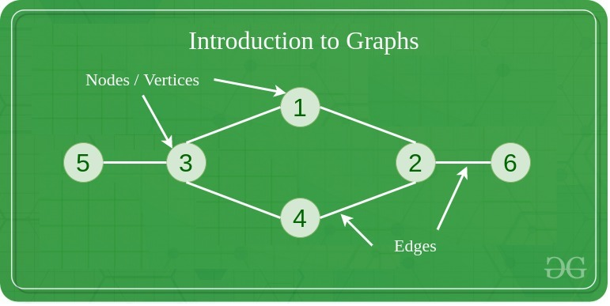
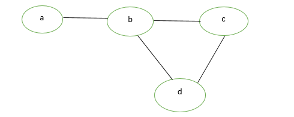
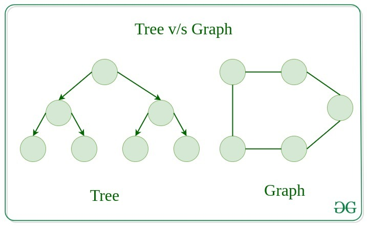

# Graph
## What is Graph
A Graph is a non-linear data structure consisting of vertices and edges. The vertices are sometimes also referred to as nodes and the edges are lines or arcs that connect any two nodes in the graph. More formally a Graph is composed of a set of vertices(V) and a set of edges(E). The graph is denoted by G(E, V).


## Components of a Graph
* Vertices: Vertices are the fundamental units of the graph. Sometimes, vertices are also known as vertex or nodes. Every node/vertex can be labeled or unlabelled.
* Edges: Edges are drawn or used to connect two nodes of the graph. It can be ordered pair of nodes in a directed graph. Edges can connect any two nodes in any possible way. There are no rules. Sometimes, edges are also known as arcs. Every edge can be labeled/unlabelled.

## Types of Graph
1. Null Graph
A graph is known as a null graph if there are no edges in the graph.
2. Trivial Graph
Graph having only a single vertex, it is also the smallest graph possible.

3. Undirected Graph
A graph in which edges do not have any direction. That is the nodes are unordered pairs in the definition of every edge. 
4. Directed Graph
A graph in which edge has direction. That is the nodes are ordered pairs in the definition of every edge.

5. Connected Graph
The graph in which from one node we can visit any other node in the graph is known as a connected graph. 
6. Disconnected Graph
The graph in which at least one node is not reachable from a node is known as a disconnected graph.

7. Simple Graph
A simple graph is a graph that does not have more than one edge between any two vertices and no edge starts and ends at the same vertex. In other words a simple graph is a graph without loops and multiple edges.

8. More Types : https://www.geeksforgeeks.org/introduction-to-graphs-data-structure-and-algorithm-tutorials/


## Graph vs Tree
Trees are the restricted types of graphs, just with some more rules. Every tree will always be a graph but not all graphs will be trees. Linked List, Trees, and Heaps all are special cases of graphs. 


|The basis of Comparison|Graph|Tree|
|----|----|----|
|Definition|Graph is a non-linear data structure.|Tree is a non-linear data structure.|
|Structure|It is a collection of vertices/nodes and edges.|It is a collection of nodes and edges.
|Structure cycle|A graph can be connected or disconnected, can have cycles or loops, and does not necessarily have a root node.	|A tree is a type of graph that is connected, acyclic (meaning it has no cycles or loops), and has a single root node.| 
|Edges|Each node can have any number of edges.|If there is n nodes then there would be n-1 number of edges|
|Types of Edges|hey can be directed or undirected|They are always directed|
|Root node|There is no unique node called root in graph.|	There is a unique node called root(parent) node in trees.|
|Loop Formation|A cycle can be formed.|There will not be any cycle.|
|Traversal|For graph traversal, we use Breadth-First Search (BFS), and Depth-First Search (DFS).|We traverse a tree using in-order, pre-order, or post-order traversal methods.|
|Applications|For finding shortest path in networking graph is used.|For game trees, decision trees, the tree is used.|
|Node relationships|In a graph, nodes can have any number of connections to other nodes, and there is no strict parent-child relationship.|In a tree, each node (except the root node) has a parent node and zero or more child nodes.|
|Commonly used for|Graphs are commonly used to model complex systems or relationships, such as social networks, transportation networks, and computer networks.|Trees are commonly used to represent data that has a hierarchical structure, such as file systems, organization charts, and family trees.|
|Connectivity|In a graph, nodes can have any number of connections to other nodes.|In a tree, each node can have at most one parent, except for the root node, which has no parent.|

## Implement a Simple Graph
``` C Sharp
using System;
using System.Collections.Generic;

// Define a class to represent a vertex in the graph
class Vertex<T>
{
    public T Data { get; }
    public List<Vertex<T>> Neighbors { get; }

    public Vertex(T data)
    {
        Data = data;
        Neighbors = new List<Vertex<T>>();
    }

    public void AddNeighbor(Vertex<T> neighbor)
    {
        Neighbors.Add(neighbor);
    }
}

// Define a class to represent the graph itself
class Graph<T>
{
    public List<Vertex<T>> Vertices { get; }

    public Graph()
    {
        Vertices = new List<Vertex<T>>();
    }

    public void AddVertex(T data)
    {
        Vertices.Add(new Vertex<T>(data));
    }

    public void AddEdge(Vertex<T> source, Vertex<T> destination)
    {
        if (!Vertices.Contains(source) || !Vertices.Contains(destination))
            throw new InvalidOperationException("Source or destination vertex not found in the graph.");

        source.AddNeighbor(destination);
        // If your graph is undirected, you can add the reverse edge as well:
        // destination.AddNeighbor(source);
    }
}

class Program
{
    static void Main()
    {
        Graph<int> graph = new Graph<int>();

        // Add vertices
        graph.AddVertex(1);
        graph.AddVertex(2);
        graph.AddVertex(3);
        graph.AddVertex(4);

        // Add edges
        graph.AddEdge(graph.Vertices[0], graph.Vertices[1]);
        graph.AddEdge(graph.Vertices[0], graph.Vertices[2]);
        graph.AddEdge(graph.Vertices[1], graph.Vertices[3]);

        // Accessing neighbors
        Console.WriteLine("Neighbors of vertex 1:");
        foreach (var neighbor in graph.Vertices[0].Neighbors)
        {
            Console.WriteLine(neighbor.Data);
        }
    }
}

```