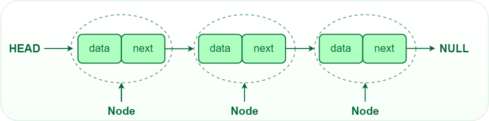
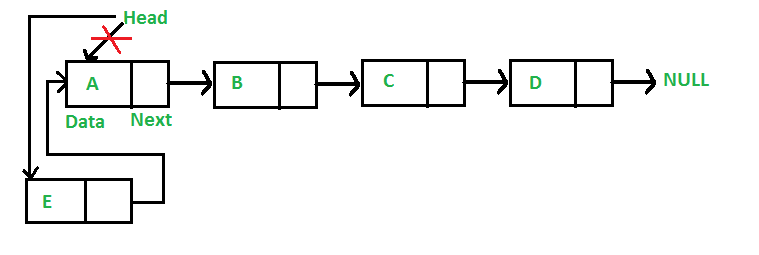
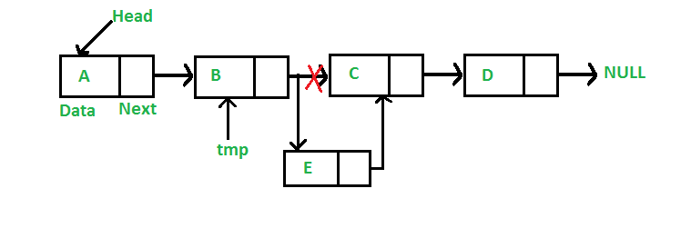
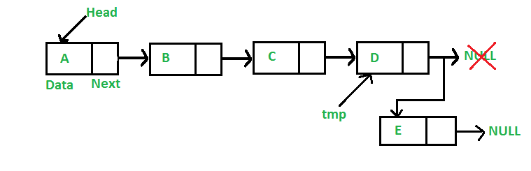

# Linked List
## Linde List 
Linked List is a linear data structure, in which elements are not stored at a contiguous location, rather they are linked using pointers. Linked List forms a series of connected nodes, where each node stores the data and the address of the next node.



## Node Structure
* #### Data :
  The actual data value stored in the node
* #### Next Pointer:
   It stores the memory address (reference) of the next node in the sequence.
* #### Head and Tail: 
  The linked list is accessed through the head node, which points to the first node in the list. The last node in the list points to NULL or nullptr, indicating the end of the list. This node is known as the tail node.

## How to create a linked list
1. Create the node strucure
2. Define the head
3. Define the node and link the pre and next node to this node (null to next if this is the last node)

## How to traverse a linked list
Start from the head, get the value and use the next poiniter to access the next node in the link and get the stored value. When the poiniter hits the null, we are at the end of the linked list.

## How to search an element in a linked list
* Iterative Approach:
  * Initialize a node pointer, current = head.
  * Do following while current is not NULL
     * If the current value (i.e., current->key) is equal to the key being searched return true.
    * Otherwise, move to the next node (current = current->next).
  * If the key is not found, return false 
  
  ``` C Sharp
    // Iterative C# program to search an element
    // in linked list
    using System;
 
    // Node class
    public class Node {
        public int data;
        public Node next;
        public Node(int d)
        {
            data = d;
            next = null;
        }
    }
    
    // Linked list class
    public class LinkedList {
        Node head; // Head of list
    
        // Inserts a new node at the front of the list
        public void push(int new_data)
        {
            // Allocate new node and putting data
            Node new_node = new Node(new_data);
    
            // Make next of new node as head
            new_node.next = head;
    
            // Move the head to point to new Node
            head = new_node;
        }
    
        // Checks whether the value x is present in linked list
        public bool search(Node head, int x)
        {
            Node current = head; // Initialize current
            while (current != null) {
                if (current.data == x)
                    return true; // data found
                current = current.next;
            }
            return false; // data not found
        }
    
        // Driver code
        public static void Main(String[] args)
        {
    
            // Start with the empty list
            LinkedList llist = new LinkedList();
    
            /*Use push() to construct below list
            14->21->11->30->10 */
            llist.push(10);
            llist.push(30);
            llist.push(11);
            llist.push(21);
            llist.push(14);
            
            int x = 21;
            // Function call
            if (llist.search(llist.head, x))
                Console.WriteLine("Yes");
            else
                Console.WriteLine("No");
        }
    }
  ```

  * Time Complexity: O(N), Where N is the number of nodes in the LinkedList
  * Auxiliary Space: O(1)

* Recursive Approach
  * If the head is NULL, return false.
  * If the head’s key is the same as X, return true;
  * Else recursively search in the next node. 
  
  ``` C Sharp 
    // Recursive C# program to search
    // an element in linked list
    using System;
    
    // Node class
    public class Node {
        public int data;
        public Node next;
        public Node(int d)
        {
            data = d;
            next = null;
        }
    }
    
    // Linked list class
    public class LinkedList {
        Node head; // Head of list
    
        // Inserts a new node at the front of the list
        public void push(int new_data)
        {
            // Allocate new node and putting data
            Node new_node = new Node(new_data);
    
            // Make next of new node as head
            new_node.next = head;
    
            // Move the head to point to new Node
            head = new_node;
        }
    
        // Checks whether the value x is present
        // in linked list
        public bool search(Node head, int x)
        {
            // Base case
            if (head == null)
                return false;
    
            // If key is present in current node,
            // return true
            if (head.data == x)
                return true;
    
            // Recur for remaining list
            return search(head.next, x);
        }
    
        // Driver code
        public static void Main()
        {
            // Start with the empty list
            LinkedList llist = new LinkedList();
    
            /* Use push() to construct below list
            14->21->11->30->10 */
            llist.push(10);
            llist.push(30);
            llist.push(11);
            llist.push(21);
            llist.push(14);
            int x = 21;
            // Function call
            if (llist.search(llist.head, x))
                Console.WriteLine("Yes");
            else
                Console.WriteLine("No");
        }
    } 
  ```

  * Time Complexity: O(N)
  * Auxiliary Space: O(N), Stack space used by recursive calls

## Insert Node
+ Insert at Front/Beginning
  + Make the first node of Linked List linked to the new node
  + Remove the head from the original first node of Linked List
  + Make the new node as the Head of the Linked List.
  
  + Time Complexity: O(1), We have a pointer to the head and we can directly attach a node and change the pointer. So the Time complexity of inserting a node at the head position is O(1) as it does a constant amount of work.
  + Auxiliary Space: O(1)


+ Insert after a given node/position
  + Check if the given node/node at the given position exists or not. 
    + If it do not exists, 
      + terminate the process.
    + If the given node exists,
      + Make the element to be inserted as a new node
      + Change the next pointer of given node to the new node
      + Now shift the original next pointer of given node to the next pointer of new node 
    
    + Time complexity: O(1), since prev_node is already given as argument in a method, no need to iterate over list to find prev_node
    + Auxiliary Space: O(1) since using constant space to modify pointers

+ Insert at End
  + Go to the last node of the Linked List
  + Change the next pointer of last node from NULL to the new node
  + Make the next pointer of new node as NULL to show the end of Linked List
  
  + Time complexity: O(N), where N is the number of nodes in the linked list. Since there is a loop from head to end, the function does O(n) work. 
    + This method can also be optimized to work in O(1) by keeping an extra pointer to the tail of the linked list/
  + Auxiliary Space: O(1)