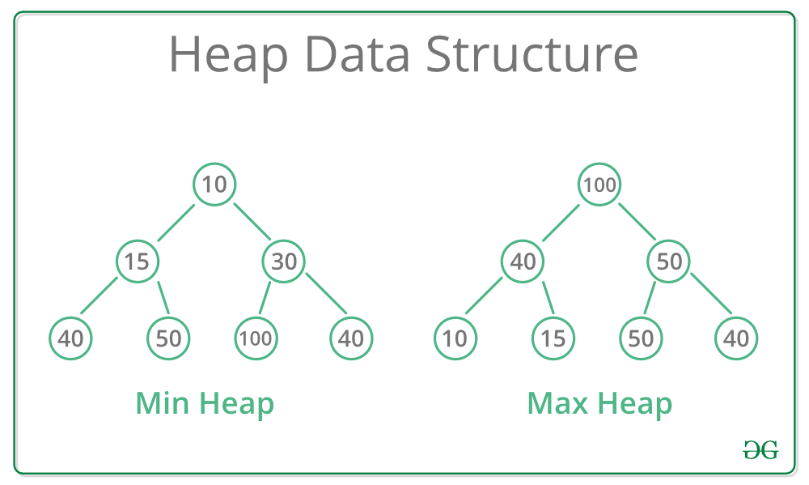

# Heap
## What is Heap
A Heap is a special Tree-based data structure in which the tree is a complete binary tree.

+ ### Max Heap
    In a Max-Heap the key present at the root node must be greatest among the keys present at all of it’s children. The same property must be recursively true for all sub-trees in that Binary Tree.

+ ### Min Heap
    In a Min-Heap the key present at the root node must be minimum among the keys present at all of it’s children. The same property must be recursively true for all sub-trees in that Binary Tree.

## Operations of Heap Data Structure:

* Heapify: a process of creating a heap from an array.
* Insertion: process to insert an element in existing heap time complexity O(log N).
* Deletion: deleting the top element of the heap or the highest priority element, and then organizing the heap and returning the element with time complexity O(log N).
* Peek: to check or find the first (or can say the top) element of the heap.

## Application of Heap
* Priority queues: The heap data structure is commonly used to implement priority queues, where elements are stored in a heap and ordered based on their priority. This allows constant-time access to the highest-priority element, making it an efficient data structure for managing tasks or events that require prioritization.
* Heapsort algorithm: The heap data structure is the basis for the heapsort algorithm, which is an efficient sorting algorithm with a worst-case time complexity of O(n log n). The heapsort algorithm is used in various applications, including database indexing and numerical analysis.
* Memory management: The heap data structure is used in memory management systems to allocate and deallocate memory dynamically. The heap is used to store the memory blocks, and the heap data structure is used to efficiently manage the memory blocks and allocate them to programs as needed.
* Graph algorithms: The heap data structure is used in various graph algorithms, including Dijkstra’s algorithm, Prim’s algorithm, and Kruskal’s algorithm. These algorithms require efficient priority queue implementation, which can be achieved using the heap data structure.
* Job scheduling: The heap data structure is used in job scheduling algorithms, where tasks are scheduled based on their priority or deadline. The heap data structure allows efficient access to the highest-priority task, making it a useful data structure for job scheduling applications.
* #### Real-Time Application of Heap:
  - Patient treatment: In a hospital, an emergency patient, or the patient with more injury is treated first. Here the priority is the degree of injury.
  - Systems concerned with security use heap sort, like the Linux kernel.

## Advantages of Heap Data Structure:

* Efficient insertion and deletion: The heap data structure allows efficient insertion and deletion of elements. When a new element is added to the heap, it is placed at the bottom of the heap and moved up to its correct position using the heapify operation. Similarly, when an element is removed from the heap, it is replaced by the bottom element, and the heap is restructured using the heapify operation.
* Efficient priority queue: The heap data structure is commonly used to implement a priority queue, where the highest priority element is always at the top of the heap. The heap allows constant-time access to the highest priority element, making it an efficient data structure for implementing priority queues.
* Guaranteed access to the maximum or minimum element: In a max-heap, the top element is always the maximum element, and in a min-heap, the top element is always the minimum element. This provides guaranteed access to the maximum or minimum element in the heap, making it useful in algorithms that require access to the extreme values.
* Space efficiency: The heap data structure requires less memory compared to other data structures, such as linked lists or arrays, as it stores elements in a complete binary tree structure.
* Heap-sort algorithm: The heap data structure forms the basis for the heap-sort algorithm, which is an efficient sorting algorithm that has a worst-case time complexity of O(n log n).

## Disadvantages of Heap Data Structure:

* Lack of flexibility: The heap data structure is not very flexible, as it is designed to maintain a specific order of elements. This means that it may not be suitable for some applications that require more flexible data structures.
* Not ideal for searching: While the heap data structure allows efficient access to the top element, it is not ideal for searching for a specific element in the heap. Searching for an element in a heap requires traversing the entire tree, which has a time complexity of O(n).
* Not a stable data structure: The heap data structure is not a stable data structure, which means that the relative order of equal elements may not be preserved when the heap is constructed or modified.
* Memory management: The heap data structure requires dynamic memory allocation, which can be a challenge in some systems with limited memory. In addition, managing the memory allocated to the heap can be complex and error-prone.
* Complexity: While the heap data structure allows efficient insertion, deletion, and priority queue implementation, it has a worst-case time complexity of O(n log n), which may not be optimal for some applications that require faster algorithms.

## Why and when to use heap?
Heaps are used in a variety of algorithms and data structures to efficiently manage and retrieve elements based on their priority. Some of the main use cases of heaps include:

* Priority Queues: Heaps can be used to implement priority queues, where elements with higher priority are retrieved before elements with lower priority.
* Sorting: Heapsort is a comparison-based sorting algorithm that can sort an array in O(n log n) time.
* Graph algorithms: Heaps are used in graph algorithms such as Dijkstra’s shortest path algorithm to efficiently find the node with the smallest distance from the source.
* Median Maintenance: Heaps can be used to efficiently maintain the median of a dynamic set of numbers.
* Scheduling Tasks: Heaps can be used to schedule tasks based on their priority in real-time operating systems.
* Memory Management: Heaps are used in memory management to allocate and deallocate memory efficiently.